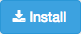

## MoneyThing Browser Extension

You need to install Greasemonkey/Tampermonkey first:
* Chrome: http://chrome.google.com/webstore/detail/tampermonkey/dhdgffkkebhmkfjojejmpbldmpobfkfo
* Firefox: https://addons.mozilla.org/en-US/firefox/addon/tampermonkey/?src=ss

Like what you see?  to the author!
